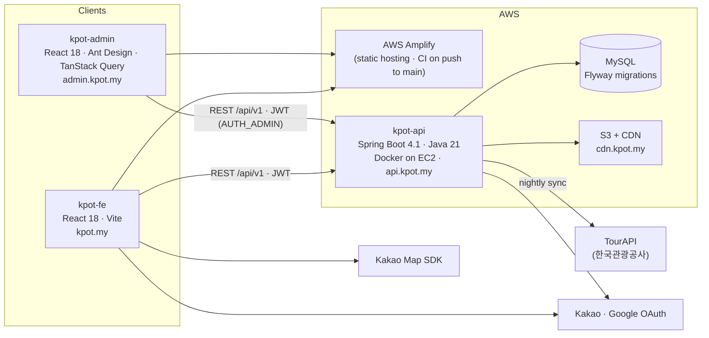

<div align="center">


# KPOT

### Where fandom becomes a journey ✨

*Turn the places your favorite K-pop artists love into your next trip.*

<br/>

[](https://kpot.my)
[](https://api.kpot.my)
[](https://admin.kpot.my)

<br/>

[](https://react.dev/)
[](https://vitejs.dev/)
[](https://reactrouter.com/)
[](https://ant.design/)

[](https://openjdk.org/)
[](https://spring.io/)
[](https://www.mysql.com/)
[](https://aws.amazon.com/)
[](https://apis.map.kakao.com/)

</div>

---

## 🎤 About

**KPOT** is a travel discovery service that maps **K-pop artists to the real-world places they're connected to** — the café an idol loves, the studio where a music video was filmed, the agency building fans line up in front of, the venue where a concert was held.

For global fans, *being a fan* and *planning a trip to Korea* are the same dream. KPOT turns that dream into a route: search an artist, explore their spots on the map, **certify your visit with GPS**, earn XP, write a review, and share the trip with fellow travelers.

> Built for the **2026 Korea Tourism Data Utilization Competition** (관광데이터 활용 공모전), KPOT reimagines open tourism data (**한국관광공사 TourAPI**) through the lens of K-pop culture.

> 🇰🇷 **한국어 요약** — KPOT은 K-pop 아티스트와 연관된 장소(스팟)를 지도에서 찾고, GPS로 방문을 인증하고, 리뷰·커뮤니티로 팬들과 공유하는 서비스입니다. 주 사용자는 K-pop 성지순례를 위해 방한하는 일본어·영어권 관광객이며, 한국관광공사 TourAPI 데이터에 관리자 큐레이션과 팬 제보를 더해 스팟을 구축합니다.

---

## 📸 Screens

<div align="center">

**Home** — popular artists, trending spots, category chips, unified search


<br/><br/>

**Map** — Kakao Map with bounds-based spot loading, 8 category filters, "Top 10 nearby", favorites-only toggle


<br/><br/>

**Spot Detail** — gallery, rating breakdown, multilingual reviews, visit certification, related contents


<br/><br/>

**Mobile** — a separate mobile component set for every screen · shown here in **EN · EN · KO · JA**


<br/><br/>

<table>
<tr>
<td align="center"><b>Community</b> — free board & companion recruitment<br/><br/></td>
<td align="center"><b>Artist</b> — spots, related contents, related artists<br/><br/></td>
</tr>
</table>

</div>

---

## ✨ Features

| | Feature | Description |
|---|---|---|
| 🔎 | **Unified Search** | Search artists and spots together, with recent / popular / related suggestions. |
| 🗺️ | **Spot Map** | Kakao Map with **bounds-based** loading, "Top 10 nearby" list, and category / favorites filters. |
| 🏷️ | **8 Categories** | Restaurant · Cafe · Attraction · Culture · Shopping · Business · Accommodation · Nature. |
| 📍 | **Spot Detail** | Photo gallery, star rating with distribution, opening hours & website, event period badge for concerts / festivals, the artist and **evidence** behind each place. |
| 🎬 | **Related Contents** | Admin-curated YouTube links (auto-filled via oEmbed) that prove a spot's K-pop relevance. |
| ✅ | **GPS Visit Certification** | Prove you were there — Haversine proximity check against the spot's coordinates. |
| 🏆 | **XP & Levels** | Every review, visit, post, and accepted spot report earns XP. Level-ups arrive as notifications; a full XP ledger lives in My Page. |
| ⭐ | **Reviews** | 1–5 rating, photos, language tag, like / comment / reply, filter by reviewers from your own country. |
| 💗 | **Bookmarks** | Save spots to revisit; a favorites-only layer on the map. |
| 📝 | **Community** | Free board + **companion recruitment** (find travel buddies) with comments, replies, likes, and view counts. |
| 🙋 | **Onboarding** | Pick your favorite artists and nationality; the feed and review filters are tuned to you. |
| 🔔 | **Notifications** | Likes, comments, replies, inquiry answers, report results, and level-ups. |
| ➕ | **Fan Contributions** | Report a new spot (with evidence images), suggest edits, flag problems, request a new artist. |
| 🚩 | **Moderation** | Report spots, reviews, posts, comments, and companions with structured reasons; admins resolve in a queue. |
| 💬 | **Inquiries & FAQ** | 1:1 inquiries with image attachments and a multilingual FAQ. |
| 🔐 | **Accounts** | Email sign-up with verification, **Kakao / Google** social login, password reset by mail link. |
| 🌐 | **Multilingual** | Fully localized UI in **Korean · Japanese · English**; server-side translations for spot, artist and FAQ content. |
| 📱 | **Desktop & Mobile** | Every screen ships as a dedicated desktop component **and** a dedicated mobile component. |

---

## 🧭 The Fan Journey

```
  Pick your bias  →  Explore their spots  →  Go there  →  Certify with GPS  →  Earn XP  →  Review & share
   (onboarding)        (search · map)        (route)      (visit)             (level up)   (community)
```

### XP sources (v1)

| Action | XP | Granted when |
|---|---:|---|
| 🗂️ Spot report accepted | **+50** | An admin publishes your report as a real spot |
| ⭐ Write a review | **+20** | Review created |
| ✅ Certified visit | **+15** | GPS proximity check succeeds |
| 📝 Community post | **+10** | Post created |

> Amounts are farm-resistant by design: the highest reward is gated on admin acceptance, and the ledger is append-only.

---

## 🗄️ Where the data comes from

KPOT spots enter the system through three pipelines, all landing in the same `Spot` model:

| Source | How | Notes |
|---|---|---|
| 🏛️ **TourAPI** (한국관광공사) | **Nightly sync** of performance venues, festivals and K-pop-related places, filtered by music-related keywords | Event spots carry `eventStartDate / eventEndDate` and show a period badge |
| 🛠️ **Admin curation** | Back-office entry with artist links, evidence (source type + URL + quote), gallery, translations, related contents | Every artist ↔ spot link requires evidence |
| 🙋 **Fan reports (UGC)** | Users report a spot with evidence images → admin review queue → publish | Publishing grants the reporter +50 XP |

Artist ↔ Spot is **many-to-many** (`ArtistSpot`), so one café can belong to several idols and one artist can have dozens of spots.

---

## 🏗️ Architecture



- **Auth** — JWT access token (1h, stateless) + refresh token (14d, persisted & rotated). Roles: `AUTH_USER`, `AUTH_ADMIN`.
- **API** — `/api/v1/*`, ~160 endpoints across 18 domains (artist, spot, review, visit, bookmark, post, companion, interaction, notification, gamification, ingestion, tourapi, inquiry, translation, member, auth, admin, stats).
- **Schema** — Flyway-managed; Hibernate runs in `validate` mode so entities never drift from migrations.
- **Delivery** — Frontend & admin deploy from `main` via **AWS Amplify**; API deploys via **GitHub Actions → SSH → `docker compose up --build`** on EC2.
- **Images** — uploaded to S3 inside the write transaction and served from `cdn.kpot.my`.

---

## 📦 Repositories

| Repository | What it is | Stack |
|---|---|---|
| [**kpot-fe**](https://github.com/Kpot-for-tour/kpot-fe) | The fan-facing web app — 34 routes, desktop + mobile components, KO/JA/EN | React 18 · Vite 5 · React Router 7 · CSS Modules + design tokens · Playwright |
| [**kpot-api**](https://github.com/Kpot-for-tour/kpot-api) | REST API, auth, TourAPI ingestion, gamification, moderation | Java 21 · Spring Boot 4.1 · Spring Security (JWT) · JPA · MySQL · Flyway · S3 |
| [**kpot-admin**](https://github.com/Kpot-for-tour/kpot-admin) | Back-office — spot/artist entry, 4 review queues, reports, inquiries, translations, TourAPI sync, dashboard | React 18 · Ant Design 5 · TanStack Query 5 · Recharts |
| [**kpot-document**](https://github.com/Kpot-for-tour/kpot-document) | Single source of truth — product plans, domain contracts, ADRs, ops, and the project-wide `TODO.md` | Markdown |
| [**.github**](https://github.com/Kpot-for-tour/.github) | This organization profile | — |

---

## 🧩 Tech Stack in Depth

**Frontend (`kpot-fe`)**

- **React 18 + Vite 5**, **React Router v7** (`createBrowserRouter`), `ResponsiveRoute` that renders a desktop or mobile component by viewport width
- **CSS Modules** with CSS-variable **design tokens** (color, typography, spacing, radius, shadow) extracted directly from Figma — no Tailwind, no CSS-in-JS
- **Pretendard Variable** typeface, **lottie-react** animations
- Custom **i18n** layer (KO / JA / EN) — static UI strings from dictionaries, dynamic content translated server-side
- No global state library by design; local state only until it's actually needed
- **Playwright** end-to-end sweeps for every route (anonymous & logged-in), i18n checks, mobile checks, and a design-QA seeding toolkit
- **SEO** — OG tags for link previews, Naver/Google site verification, generated SEO metadata

**Backend (`kpot-api`)**

- **Java 21 · Spring Boot 4.1 · Spring Security (JWT) · Spring Data JPA · Lombok**
- Layering: Controller (HTTP + `@Secured`) → Service (`@Transactional`) → Repository; infrastructure behind interfaces (`FileManager ← S3FileManager`)
- Polymorphic **Like / Comment / Report** shared across reviews, posts, companions, and spots
- **Soft delete** via `LogicalDeleteEntity`, `@EntityGraph` against N+1
- Profiles: `local / dev / prod`, secrets only via environment variables
- Domain docs per module (`docs/domain/*.md`) plus a build roadmap

**Admin (`kpot-admin`)**

- **Ant Design 5** tables/forms/drawers themed with the brand red, **TanStack Query 5** for server state with per-mutation invalidation and live sidebar badges
- Kakao Map coordinate picker, image manager (append / delete / reorder), bulk artist linking, translation panel, data-quality audit view
- Playwright route walk that must print `21/21 통과` before a change is called done

**Infrastructure**

- **AWS Amplify** (web + admin) · **EC2 + Docker** (API) · **MySQL** · **S3 + CDN** · **GitHub Actions**
- Domains: `kpot.my` · `api.kpot.my` · `admin.kpot.my` · `cdn.kpot.my`

---

## 🔬 How we work

- **Docs first, single source of truth** — `kpot-document/TODO.md` holds every open item across backend and frontend. Each item carries a `Verify:` command; we trust *code > docs > memory*.
- **Backend changes ship with frontend instructions** — any change to an endpoint or payload lands in `TODO.md` as an FE-actionable item in the same round.
- **Figma-driven** — every screen maps to a Figma node; tokens are extracted, not eyeballed.
- **Verify before "done"** — a task is complete when it's deployed and the Playwright sweep passes.
- **ADRs** for the big calls (e.g. *companion group chat: Spring MVC + WebSocket/STOMP + Redis relay*, *deferring Next.js / responsive refactor*).
- **Branching** — `feature/*` → `dev` → `main`; `main` is deploy-only. **Conventional Commits** everywhere.

---

## 🎨 Design

KPOT is built on a Figma-driven design system. Every screen maps to a Figma node, and all visual values flow from a shared token file — keeping the product pixel-consistent and easy to scale.

A warm signature red (`#F74C4C`) sets the tone: energetic, friendly, and unmistakably K-pop.

---

## 👥 Team

<div align="center">

| Role | Members |
|:---:|:---:|
| 💻 **Developers** | 원순재 · Sunjae Won &nbsp;·&nbsp; 김민정 · Minjeong Kim |
| 🎨 **Designers** | 이동휘 · Donghwi Lee &nbsp;·&nbsp; 양나영 · Nayeong Yang |

</div>

<div align="center">

<br/>

**🌐 [kpot.my](https://kpot.my)**

*Made with 💗 for fans who travel.*

</div>
