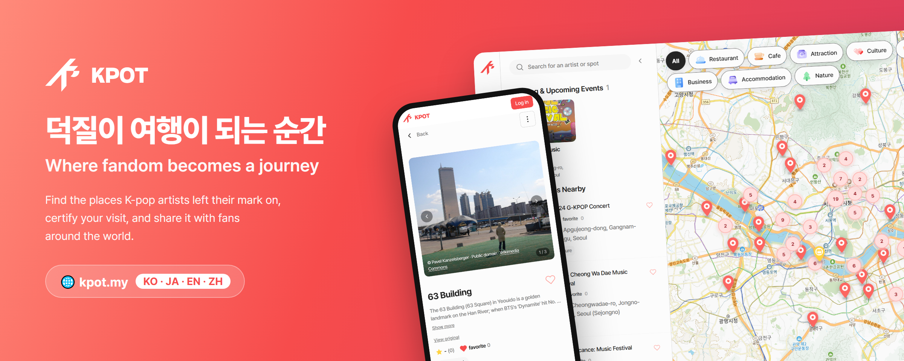
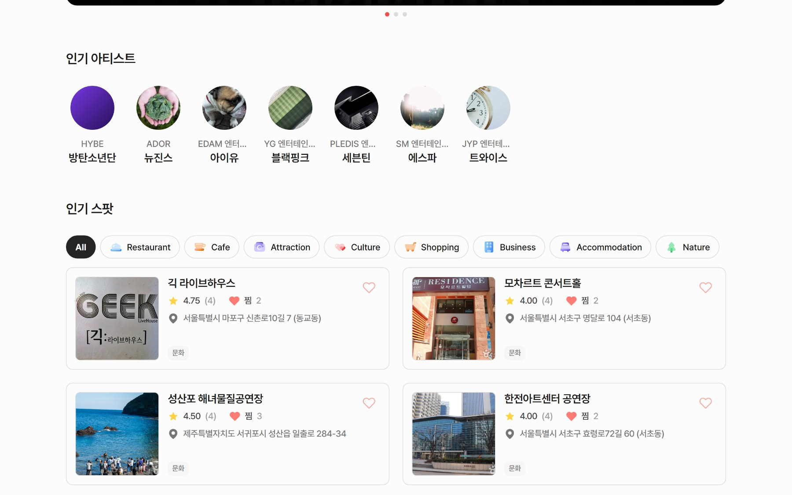
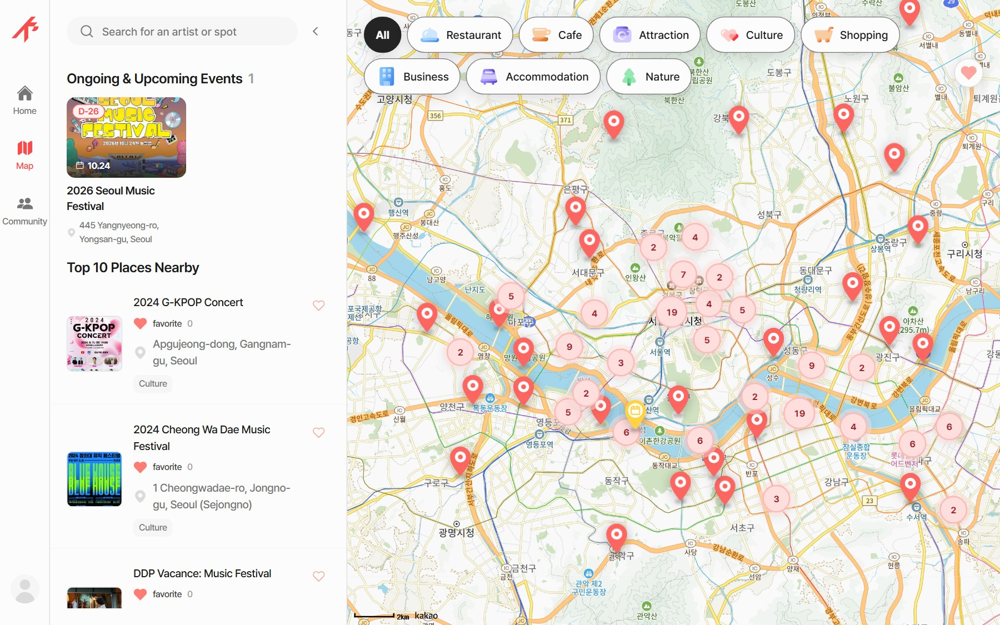
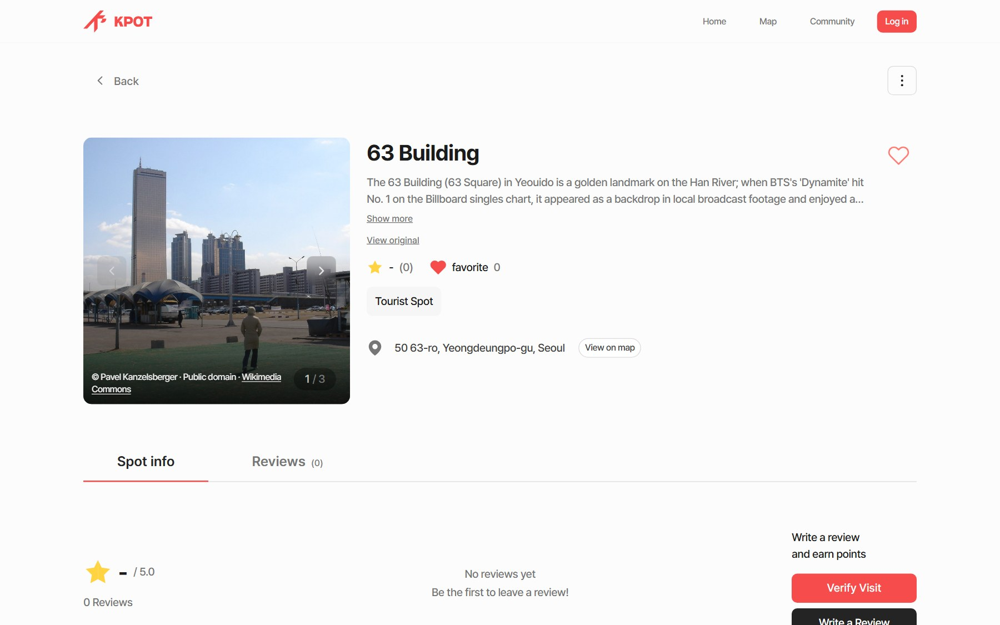
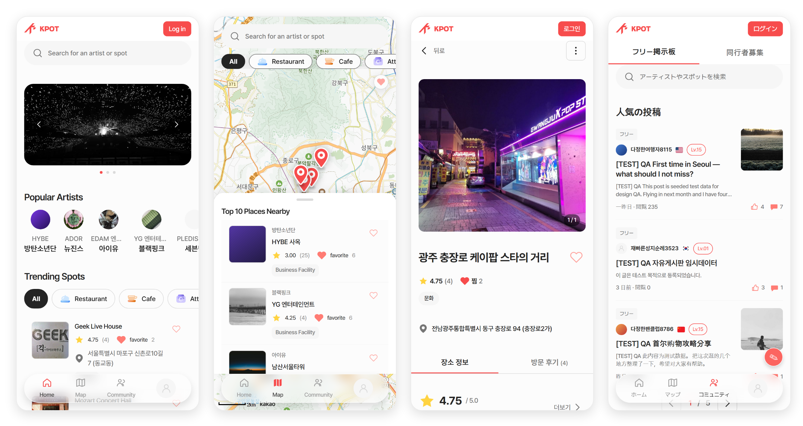
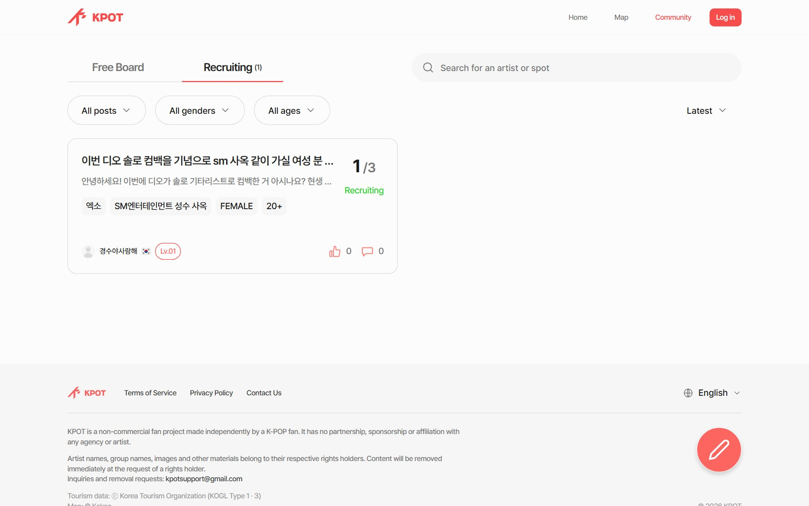
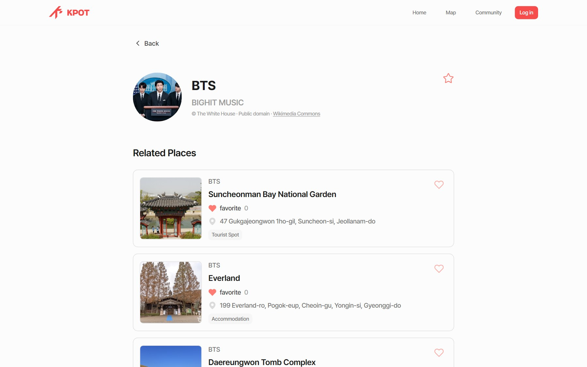
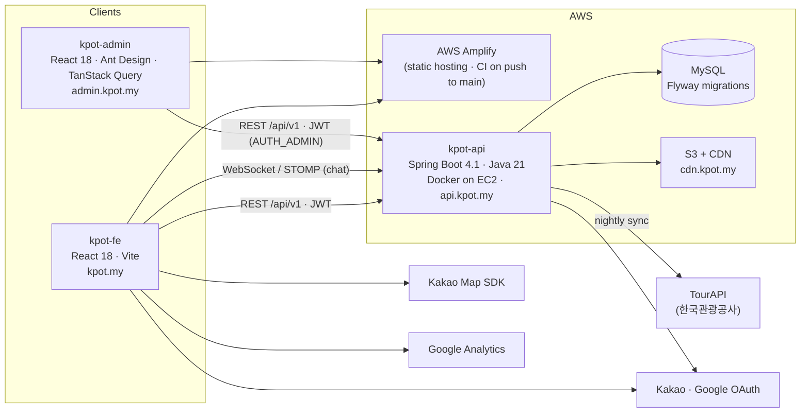

<div align="center">



# KPOT

### Where fandom becomes a journey ✨

*Turn the places your favorite K-pop artists love into your next trip.*

<br/>

[](https://kpot.my)
[](https://api.kpot.my)
[](https://admin.kpot.my)

<br/>

[](https://react.dev/)
[](https://vitejs.dev/)
[](https://reactrouter.com/)
[](https://ant.design/)
[](https://playwright.dev/)

[](https://openjdk.org/)
[](https://spring.io/)
[](https://stomp.github.io/)
[](https://www.mysql.com/)
[](https://aws.amazon.com/)
[](https://apis.map.kakao.com/)

</div>

---

## 🎤 About

**KPOT** is a travel discovery service that maps **K-pop artists to the real-world places they're connected to** — the café an idol loves, the studio where a music video was filmed, the agency building fans line up in front of, the venue where a concert was held.

For global fans, *being a fan* and *planning a trip to Korea* are the same dream. KPOT turns that dream into a route: pick your favorite artists, explore their spots on the map, **certify your visit on-site**, earn XP, write a review, find travel companions and chat with them.

> Built for the **2026 Korea Tourism Data Utilization Competition** (관광데이터 활용 공모전), KPOT reimagines open tourism data (**한국관광공사 TourAPI**, 한국문화정보원 촬영지 데이터) through the lens of K-pop culture.

> 🇰🇷 **한국어 요약** — KPOT은 K-pop 아티스트와 연관된 장소(스팟)를 지도에서 찾고, 현장에서 방문을 인증하고, 리뷰·커뮤니티·동행 채팅으로 팬들과 공유하는 서비스입니다. 주 사용자는 K-pop 성지순례를 위해 방한하는 일본어·영어·중국어권 관광객이며(UI 4개 언어), 한국관광공사 TourAPI와 공공데이터에 관리자 큐레이션·AI 발굴·팬 제보를 더해 스팟을 구축합니다.

---

## 📸 Screens

<div align="center">

**Home** — language-specific hero banners, popular artists, trending spots ranked by popularity score, live & upcoming events, your favorite artists, unified search



<br/><br/>

**Map** — Kakao Map with bounds-based loading, **count bubbles when zoomed out** (3 zoom tiers), event pins with a halo, 8 category filters, favorites-only toggle



<br/><br/>

**Spot Detail** — gallery with photo credits, rating breakdown, multilingual reviews, visit certification, related videos & photos, "open on map", data sources block



<br/><br/>

**Mobile** — a separate mobile component set for every screen · shown here in **EN · EN · KO · JA** (Chinese added since)



<br/><br/>

<table>
<tr>
<td align="center"><b>Community</b> — free board & companion recruitment with group chat<br/><br/></td>
<td align="center"><b>Artist</b> — spots, related contents, favorite toggle, official fandom color as the app accent<br/><br/></td>
</tr>
</table>

</div>

---

## ✨ Features

| | Feature | Description |
|---|---|---|
| 🔎 | **Unified Search** | Search artists and spots together, with recent / popular / related suggestions. Debounced so Korean IME input on iPhone never splits into jamo. |
| 🗺️ | **Spot Map** | Kakao Map with **bounds-based** loading; zoomed out, spots collapse into **grid clusters** with counts (server-side `GET /spots/map/clusters`), zoomed in they become pins. Event spots get a colored halo while live. |
| 🏷️ | **8 Categories** | Tourist Spot · Culture · Restaurant · Cafe · Shopping · Business Facility · Accommodation · Nature. |
| 📍 | **Spot Detail** | Photo gallery, star rating with distribution, opening hours & website, event period badge for concerts / festivals, the artist and **evidence** behind each place, and a **data sources** block crediting every photo and tourism record. |
| 🎬 | **Related Contents** | Curated YouTube videos (thumbnails via oEmbed) and hosted photos that prove a spot's K-pop relevance. One card can name several artists. |
| ✅ | **Visit Certification** | The 100 m proximity check runs **entirely on the device** — the server only learns that you visited, never where you are (ADR 0008). |
| 🏆 | **XP & Levels** | Every review, visit, post, and accepted spot report earns XP. Level-ups arrive as notifications; a full XP ledger lives in My Page. |
| 🔥 | **Popularity Score** | Spots and artists are ranked by weighted user actions with **daily exponential decay** (ADR 0005) — "trending" means trending now. |
| 💜 | **Favorite Artists & Theme** | Star an artist and their **officially announced fandom color** becomes the app's accent color (ADR 0009). Favorite artist chips on the home screen. |
| ⭐ | **Reviews** | 1–5 rating, photos, language tag, like / comment / reply, filter by reviewers from your own country. |
| 💗 | **Bookmarks** | Save spots to revisit; a favorites-only layer on the map. |
| 📝 | **Community** | Free board + **companion recruitment** (find travel buddies) with comments, replies, likes, view counts and public member profiles. |
| 💬 | **Chat** | Every companion post opens a **group chat room** for its members; **1:1 direct messages** between members. STOMP over WebSocket with image messages, read receipts, unread counts and in-chat reporting. |
| 🙋 | **Onboarding** | Pick your language, nationality and favorite artists; the feed, theme and review filters are tuned to you. |
| 🔔 | **Notifications** | Likes, comments, replies, inquiry answers, report results, and level-ups. |
| ➕ | **Fan Contributions** | Report a new spot (photo required), suggest edits with photos, flag problems, request a new artist, track your submissions. |
| 🚩 | **Moderation** | Report spots, reviews, posts, comments, companions and chat messages with structured reasons; admins resolve in a queue. |
| 💬 | **Inquiries & FAQ** | 1:1 inquiries with image attachments and a multilingual FAQ. |
| 🔐 | **Accounts** | Email sign-up with verification, **Kakao / Google** social login, password reset by mail link, terms & privacy policy in 4 languages. |
| 🌐 | **Multilingual** | Fully localized UI in **Korean · Japanese · English · Chinese (Simplified)**; every spot and artist carries server-side EN / JA / ZH translations. |
| 📱 | **Desktop & Mobile** | Every screen ships as a dedicated desktop component **and** a dedicated mobile component. |
| 🔗 | **Shareable links** | Per-route `<head>` (title, description, OG image), robots.txt and sitemap generated at build time so shared spot links preview correctly in KakaoTalk, X and search engines. |

---

## 🧭 The Fan Journey

```
  Pick your bias  →  Explore their spots  →  Go there  →  Certify on-site  →  Earn XP  →  Review & share  →  Find companions
   (onboarding)        (search · map)        (route)      (visit)            (level up)   (community)        (chat)
```

### XP sources (v1)

| Action | XP | Granted when |
|---|---:|---|
| 🗂️ Spot report accepted | **+50** | An admin publishes your report as a real spot |
| ⭐ Write a review | **+20** | Review created |
| ✅ Certified visit | **+15** | On-device proximity check succeeds |
| 📝 Community post | **+10** | Post created |

> Amounts are farm-resistant by design: the highest reward is gated on admin acceptance, and the ledger is append-only. Level *L* needs `50·(L−1) + 10·(L−1)²` cumulative XP.

---

## 🗄️ Where the data comes from

Production, as of **2026-09-28**:

| | Count |
|---|---:|
| Spots | **457** (450 with photos, 8 categories, nationwide) |
| Artists | **1,879** (groups and their members linked) |
| Related contents | **792** curated videos & photos on 450 spots |
| Translations | every spot and artist × **EN / JA / ZH** |
| Artist theme colors | official fandom colors for the groups that announced one |

Spots enter the system through five pipelines, all landing in the same `Spot` model with per-row provenance:

| Source | How | Notes |
|---|---|---|
| 🏛️ **TourAPI** (한국관광공사) | **Nightly sync** (06:00 KST) of performance venues, festivals and K-pop-related places; `detailCommon2` / `detailIntro2` fill descriptions, hours and websites | Event spots carry `eventStartDate / eventEndDate` and show a period badge |
| 🎬 **Public filming-location data** (한국문화정보원) | 1,961 K-pop rows extracted → image matched against TourAPI and Wikimedia Commons → only rows with a licensed image are registered (ADR 0003) | 308 spots; 1,532 rows on hold for lack of a usable image |
| 🤖 **AI-assisted discovery** (ADR 0004) | Claude proposes spots outside public data → every artist link verified against press / official video → coordinates from Wikidata / OSM → Commons image → YouTube related contents; humans only decide publish / hold | Run logs, candidate files and overrides are committed as evidence |
| 🛠️ **Admin curation** | Back-office entry with artist links, evidence (source type + URL + quote), gallery, translations, related contents | Every artist ↔ spot link requires evidence |
| 🙋 **Fan reports (UGC)** | Users report a spot with a photo → admin review queue → publish | Publishing grants the reporter +50 XP |

Artist ↔ Spot is **many-to-many** (`ArtistSpot`), so one café can belong to several idols and one artist can have dozens of spots.

**Data principles we committed to** (all recorded as ADRs in `kpot-document/decisions/`):

- Every imported photo stores its source, license and author and is credited on screen; photos whose origin can't be established are taken down (ADR 0006).
- Human-generated data — reviews, likes, bookmarks, comments, posts, companions — is **never seeded with fake users** on production (ADR 0007).
- User GPS never reaches the server (ADR 0008). Artist colors are only the ones officially announced by the agency (ADR 0009).
- Every pipeline run leaves a dated run log with per-row provenance in `kpot-document/data/`.

---

## 🏗️ Architecture



- **Auth** — JWT access token (1h, stateless) + refresh token (14d, persisted & rotated). Roles: `AUTH_USER`, `AUTH_ADMIN`.
- **API** — `/api/v1/*`, ~190 endpoints in 45 controllers across 20 domains (artist, artistspot, spot, review, visit, bookmark, post, companion, chat, interaction, notification, gamification, popularity, ingestion, tourapi, inquiry, member, auth, admin, stats). OpenAPI via springdoc.
- **Realtime** — Spring WebSocket + STOMP with 10 s heart-beats so idle sockets survive the proxy. Single instance today; a Redis relay is the planned scale-out path (ADR 0002).
- **Schema** — Flyway-managed (V22 and counting); Hibernate runs in `validate` mode so entities never drift from migrations.
- **Nightly jobs (KST)** — 04:00 popularity decay · 04:30 orphaned-image sweep · 05:00 expired-token cleanup · 05:30 notification cleanup · 06:00 TourAPI sync.
- **Delivery** — Frontend & admin deploy from `main` via **AWS Amplify** (production and dev are separate Amplify apps in separate AWS accounts; the build fails if `VITE_API_URL` is unset so the two can never cross). API deploys via **GitHub Actions → SSH → `docker compose up --build`** on EC2, `dev` branch to the dev server and `main` to production.
- **Images** — uploaded to S3 inside the write transaction and served from `cdn.kpot.my`, each with a stored credit.

---

## 📦 Repositories

| Repository | What it is | Stack |
|---|---|---|
| [**kpot-fe**](https://github.com/Kpot-for-tour/kpot-fe) | The fan-facing web app — 43 routes, desktop + mobile components, KO / JA / EN / ZH | React 18 · Vite 5 · React Router 7 · CSS Modules + design tokens · @stomp/stompjs · Playwright |
| [**kpot-api**](https://github.com/Kpot-for-tour/kpot-api) | REST + WebSocket API, auth, TourAPI ingestion, popularity, gamification, chat, moderation | Java 21 · Spring Boot 4.1 · Spring Security (JWT) · JPA · MySQL · Flyway · WebSocket/STOMP · Caffeine · S3 |
| [**kpot-admin**](https://github.com/Kpot-for-tour/kpot-admin) | Back-office — spot/artist entry, 4 review queues, reports, inquiries, translations, photo credits, TourAPI sync history, member admin, stats dashboard | React 18 · Ant Design 5 · TanStack Query 5 · Recharts |
| [**kpot-document**](https://github.com/Kpot-for-tour/kpot-document) | Single source of truth — product plans, domain contracts, 9 ADRs, ops runbooks, data pipeline run logs, and the project-wide `TODO.md` | Markdown · pipeline scripts (Python / PowerShell / Node) |
| [**.github**](https://github.com/Kpot-for-tour/.github) | This organization profile | — |

---

## 🧩 Tech Stack in Depth

**Frontend (`kpot-fe`)**

- **React 18 + Vite 5**, **React Router v7** (`createBrowserRouter`), `ResponsiveRoute` that renders a desktop or mobile component by viewport width
- **CSS Modules** with CSS-variable **design tokens** (color, typography, spacing, radius, shadow) extracted directly from Figma — no Tailwind, no CSS-in-JS. The accent token is swapped at runtime to the favorite artist's official color
- **Pretendard Variable** typeface, **lottie-react** animations, **@stomp/stompjs** for chat
- Custom **i18n** layer (KO / JA / EN / ZH) — static UI strings from dictionaries, dynamic content translated server-side
- No global state library by design; one language context plus local state and custom hooks
- Map clustering computed from a server grid endpoint; on-device geolocation for visit checks and the report map picker
- **Playwright** end-to-end suites per domain (account, community, chat, inquiry, notification, settings, social, mobile), i18n key checks, a no-mock-data check and a whole-app design QA walk
- **SEO** — per-route `<head>`, robots.txt and sitemap generated after build; Google Analytics on production only

**Backend (`kpot-api`)**

- **Java 21 · Spring Boot 4.1 · Spring Security (JWT) · Spring Data JPA · Spring WebSocket · Lombok**
- Layering: Controller (HTTP + `@Secured`) → Service (`@Transactional`) → Repository; infrastructure behind interfaces (`FileManager ← S3FileManager`)
- Polymorphic **Like / Comment / Report** shared across reviews, posts, companions, spots and chat messages
- **Soft delete** via `LogicalDeleteEntity`, `@EntityGraph` against N+1, **Caffeine** caches for hot reads
- Domain events wire modules together (companion created → chat room, member withdrawn → rooms updated, level-up → notification)
- Profiles: `local / dev / prod`, secrets only via environment variables; Gradle tests run in CI before every deploy
- Domain docs per module (`docs/domain/*.md`) plus a build roadmap

**Admin (`kpot-admin`)**

- **Ant Design 5** tables/forms/drawers themed with the brand red, **TanStack Query 5** for server state with per-mutation invalidation and live sidebar badges
- Kakao Map coordinate picker, image manager (append / delete / reorder / credit editing), bulk artist linking, multi-artist related contents, translation panel, data-quality audit view, test-account creation
- Playwright route walk that must pass before a change is called done

**Infrastructure**

- **AWS Amplify** (web + admin) · **EC2 + Docker** (API) · **MySQL** · **S3 + CDN** · **GitHub Actions**
- Domains: `kpot.my` · `api.kpot.my` · `admin.kpot.my` · `cdn.kpot.my`

---

## 🔬 How we work

- **Docs first, single source of truth** — `kpot-document/TODO.md` holds every open item across backend and frontend. Each item carries a `Verify:` command; we trust *code > docs > memory*.
- **Backend changes ship with frontend instructions** — any change to an endpoint or payload lands in `TODO.md` as an FE-actionable item in the same round.
- **Figma-driven** — every screen maps to a Figma node; tokens are extracted, not eyeballed.
- **Verify before "done"** — a task is complete when it's deployed and the Playwright sweep passes.
- **ADRs** for the big calls — deferring Next.js / responsive refactor, chat on MVC + STOMP, public-data import rules, AI-assisted discovery, popularity scoring, image credits, no fake UGC, no user location on the server, official artist colors only.
- **Data work is evidence** — every pipeline run writes a dated run log with per-row provenance; registries are committed so re-runs never duplicate.
- **Branching** — `feature/*` → `dev` → `main`; `main` is deploy-only. **Conventional Commits** everywhere.

---

## 🎨 Design

KPOT is built on a Figma-driven design system. Every screen maps to a Figma node, and all visual values flow from a shared token file — keeping the product pixel-consistent and easy to scale.

A warm signature red (`#F74C4C`) sets the tone: energetic, friendly, and unmistakably K-pop. Once you pick a favorite artist, their official fandom color takes over the accent — the app dresses in your bias's colors.

---

## 👥 Team

<div align="center">

| Role | Members |
|:---:|:---:|
| 💻 **Developers** | 원순재 · Sunjae Won &nbsp;·&nbsp; 김민정 · Minjeong Kim |
| 🎨 **Designers** | 이동휘 · Donghwi Lee &nbsp;·&nbsp; 양나영 · Nayeong Yang |

</div>

<div align="center">

<br/>

**🌐 [kpot.my](https://kpot.my)**

*Made with 💗 for fans who travel.*

</div>
